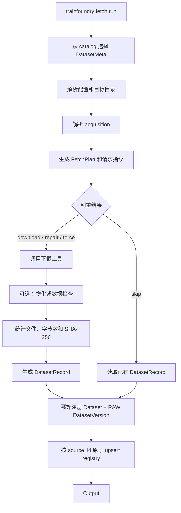

# Fetch 数据流程

本文档描述 TrainFoundry 当前的 dataset fetch 实现，包括 CLI 入口、配置解析、
下载工具、判重与重试、元数据落盘，以及现有实现的边界。

CLI 推荐使用短命令 `tf`，例如 `tf fetch list --output json`。文中的
`trainfoundry` 是完全兼容的长命令，二者行为相同。

## 快速入口

```bash
# 查看 catalog 中声明的数据集，不读取下载目录或 registry
trainfoundry fetch list --output json

# 只生成执行计划
trainfoundry fetch run coco_2017_validation --dry-run --output json

# 执行下载
trainfoundry fetch run coco_2017_validation --output json

# 校验已经登记的数据
trainfoundry dataset verify coco_2017_validation --output json
```

`trainfoundry fetch list --output json` 的数据源是
[`catalog.py`](catalog.py) 中的静态 `SOURCES`。它不是下载结果列表，也不会查询
`source_registry.json` 或远端服务。已经下载的数据需要通过 `dataset inspect` 或
`dataset verify` 查看。

## 总体流程



核心边界是：

- `DatasetMeta` 描述“需要什么”，不包含下载实现。
- acquisition adapter 描述“用什么工具获取”。
- materializer 描述“如何把工具结果变成项目所需文件”。
- `FetcherService` 负责 plan、判重、调用工具和登记元数据。
- `DatasetRecord` 描述“最终实际得到了什么”。

## 1. CLI 选择数据集

统一入口在 [`trainfoundry/cli.py`](../trainfoundry/cli.py)。

```bash
trainfoundry fetch run <source-id>... [--group <name> | --all] \
  [--dry-run | --force] [--output text|json]
```

选择方式：

| 方式 | 内容 |
| --- | --- |
| `<source-id>...` | 一个或多个明确的数据源 |
| `--group huggingface` | 三个 Hugging Face 文本数据源 |
| `--group non_text` | COCO、UCF101 和 Minari |
| `--all` | catalog 中全部七个数据源 |

`common_crawl_wet` 当前不属于任何 group，只能显式指定或通过 `--all`
选择。

`--dry-run` 只生成 `FetchPlan`，不下载文件，也不写 registry。Common Crawl
的 URL 和 revision 是动态的，因此它的 dry-run 仍会访问 Common Crawl
索引以解析当前 WET 文件。

## 2. 声明下载需求

所有数据源都在 [`catalog.py`](catalog.py) 中声明为 `DatasetMeta`：

```text
DatasetMeta
├── source_id / modality / homepage / purpose / owner / namespace
├── license / permitted_use / contains_pii / retention_policy
├── OutputSpec
│   ├── config_key
│   └── path_parts
└── acquisition
    ├── HttpAcquisition
    ├── HuggingFaceAcquisition
    ├── CommonCrawlAcquisition
    └── MinariAcquisition
```

当前数据源和工具映射：

| source_id | acquisition | 实际工具 | 结果 |
| --- | --- | --- | --- |
| `wikitext_2_raw` | Hugging Face | `datasets.load_dataset` | 各 split 的 JSONL |
| `dolly_15k` | Hugging Face | `datasets.load_dataset` | 各 split 的 JSONL |
| `hh_rlhf_helpful_base` | Hugging Face | `datasets.load_dataset` | 各 split 的 JSONL |
| `common_crawl_wet` | Common Crawl | resolver + `curl` | 一个压缩 WET 文件 |
| `coco_2017_validation` | HTTP | `curl` | 两个原始 ZIP |
| `ucf101` | HTTP | `curl` | RAR 和 split ZIP |
| `d4rl_pointmaze_umaze_minari` | Minari | `minari.load_dataset` | Minari 本地数据集 |

COCO 和 UCF101 共享同一个 `CurlDownloader`。增加新的固定 URL 数据集时，
通常只需增加 `DatasetMeta(HttpAcquisition(...))`，不需要新建 fetcher。

## 3. 解析输出目录

`FetcherService.plan()` 调用 `destination_for(meta)`，用
`OutputSpec.config_key` 从 `config/paths.toml` 读取根目录，再拼接
`path_parts`。

默认配置为：

```toml
[paths]
text_path = "model_data/text"
multimodal_path = "model_data/multimodal"
robot_path = "model_data/robot"
registry_path = "model_data/text/source_registry.json"
```

配置发现顺序：

1. `TRAINFOUNDRY_CONFIG_DIR` 指定的目录；相对路径基准可由
   `TRAINFOUNDRY_PROJECT_ROOT` 指定。
2. 当前工作目录下的 `config/paths.toml`。
3. Python 包内置配置。

安装后在项目目录之外运行且没有显式配置时，相对路径以
`~/.local/share/trainfoundry` 为基准。可用下面的命令确认最终路径：

```bash
trainfoundry config show --output json
trainfoundry config validate --output json
```

## 4. 解析请求并生成计划

`FetcherService._resolve()` 将声明转换为可执行请求：

- HTTP：直接使用 catalog 中的 URL、文件名、期望字节数和 revision。
- Hugging Face：生成 `hf://datasets/<repo_id>` 逻辑 URL。
- Minari：生成 `minari://<dataset_id>` 逻辑 URL。
- Common Crawl：先读取 crawl index，选择最新 crawl 和指定索引的 WET
  文件，再转换为普通 `HttpAcquisition`。

随后 service 对以下内容做 canonical JSON 序列化并计算 SHA-256：

- `source_id`
- 声明和解析后的 acquisition 类型
- 解析后的 acquisition 参数
- `OutputSpec`

这个值是 `request_fingerprint`。URL、revision、文件要求或 `OutputSpec`
改变都会让指纹变化。指纹记录的是 `OutputSpec` 的配置键和相对组件，不包含
该配置键当前解析出的绝对路径；单纯修改 `paths.toml` 的目录值不会改变指纹。

计划包含：

```text
source_id, tool, destination, revision, download_url,
estimated_bytes, action, reason, request_fingerprint, requirements
```

HTTP 文件只有在所有 `expected_bytes` 都已声明时才会提供
`estimated_bytes`。

## 5. 判重决策

registry 以 `source_id` 查找现有记录。决策规则如下：

| action | 条件 | 后续行为 |
| --- | --- | --- |
| `download` | 没有完整且指纹一致的记录 | 执行 acquisition |
| `skip` | 状态为 `complete`、指纹一致，且全部文件校验通过 | 直接返回已有记录 |
| `repair` | 指纹一致，但文件缺失、大小或 SHA-256 不一致 | 重新执行 acquisition |
| `force` | 用户显式传入 `--force` | 跳过 service 判重并重新执行 |

`skip` 不是只判断文件名。`verify_record()` 会检查：

- record 状态和 `file_count`
- 每个文件是否存在
- 每个文件的字节数
- 每个文件的 SHA-256
- 全部文件的 `total_bytes`

因此重复执行相同请求时可以安全跳过；本地文件被删除或损坏时会进入
`repair`。

## 6. 执行 acquisition

### HTTP 和 Common Crawl

[`downloaders/http.py`](downloaders/http.py) 使用 `curl`：

```text
curl --fail --location --continue-at - --output <file.part> <url>
```

- 普通下载写入 `<output>.part`，中断后从已有字节继续。
- 单个文件最多尝试 20 次。
- 重试等待按指数增长，最长 15 秒。
- 下载成功后校验 `expected_bytes`，再用原子 rename 替换最终文件。
- `repair` 或 `force` 使用包含 URL hash 的临时文件。在新文件完整成功前，
  已有完整文件不会被覆盖。
- catalog 中未提供 checksum，因此首次 HTTP 下载完成前只校验期望大小；
  完成后生成本地 SHA-256 并写入 registry。

Common Crawl 先由
[`resolvers/common_crawl.py`](resolvers/common_crawl.py) 动态解析 URL，
后续复用完全相同的 HTTP 流程。

### Hugging Face

[`downloaders/huggingface.py`](downloaders/huggingface.py) 调用：

```python
datasets.load_dataset(repo_id, config, data_dir=..., revision=...)
```

返回的 dataset 交给
[`materializers/jsonl.py`](materializers/jsonl.py)，每个 split 写成：

```text
<destination>/<split>.jsonl
```

record 的扩展字段会保存 split 名称。网络下载和内部缓存行为由 Hugging
Face `datasets` 管理。

### Minari

[`downloaders/minari.py`](downloaders/minari.py)：

1. 将 `MINARI_DATASETS_PATH` 设置为目标根目录。
2. 调用 `minari.load_dataset(dataset_id, download=True)`。
3. 收集 dataset 目录下的全部文件。
4. 通过 `materializers/minari_schema.py` 读取数据摘要，记录 episode、step
   和主要数组 shape。

网络下载和内部缓存行为由 Minari 管理。

`--force` 对所有 acquisition 都会重新执行 adapter；只有 HTTP adapter
明确实现了独立临时文件、续传和原子替换。Hugging Face 与 Minari 是否从
远端重新传输仍取决于各自 SDK 的缓存策略。

## 7. 生成 DatasetRecord 并注册 metadata

acquisition 和 materialization 全部成功后，
`build_dataset_record()` 才会：

1. 枚举实际产出文件。
2. 统计每个文件的字节数并计算 SHA-256。
3. 汇总 `file_count` 和 `total_bytes`。
4. 合并 catalog 中的治理元数据、解析后的 URL/revision、下载时间和工具
   扩展字段。
5. 生成状态为 `complete` 的 `DatasetRecord`。

随后 `FetchMetadataRegistrar` 会自动初始化尚未初始化的 SQLite metadata，
并执行幂等注册：

1. 以 `namespace + source_id` 创建或复用逻辑 `Dataset`。
2. 根据实际文件的相对路径、字节数和 SHA-256 计算整体 content digest。
3. 相同 digest 复用已有 `DatasetVersion`；内容发生变化才创建新版本。
4. 新版本以 `RAW / COMMITTED` 状态登记，可直接用于后续训练绑定。
5. 将 `metadata_dataset_id` 和 `metadata_version_id` 写回 DatasetRecord。

因此 `--force` 下载到相同内容时不会制造重复版本。下载、物化或 metadata
注册失败时，不会向 registry 登记新的成功记录；`--dry-run` 不写任何 metadata。

registry 默认位于 `paths.registry_path`，内容是 JSON array。写入时按
`source_id` 替换或追加记录，排序后先写 `.tmp`，再原子替换正式文件。

这意味着：

- 每个 `source_id` 只保留一条当前记录，不保存历史 revision。
- 下载、物化或 checksum 失败时不会登记一条“成功”记录。
- registry 文件写入是原子的，但当前没有跨进程锁；不要并发 fetch
  同一个 registry。

## 8. CLI 输出

执行成功后，`fetch run` 返回计划决策和最终 record：

```json
{
  "ok": true,
  "command": "fetch.run",
  "data": {
    "dry_run": false,
    "datasets": [
      {
        "action": "skip",
        "reason": "matching record and local files verified",
        "record": {
          "source_id": "coco_2017_validation",
          "status": "complete",
          "file_count": 2,
          "total_bytes": 1068492871,
          "metadata_dataset_id": "ds_...",
          "metadata_version_id": "dv_..."
        }
      }
    ]
  },
  "error": null
}
```

实际 record 还包含完整文件列表、SHA-256、revision、下载 URL、输出路径和
治理元数据。JSON 模式下，命令日志写入 `stderr`，结果 envelope 独占
`stdout`，便于 Agent 或脚本解析。

多个 source 当前按选择顺序串行执行。如果前一个 source 抛出异常，命令会
立即失败，后续 source 不再执行；已经成功写入的 source 不会回滚。

## 辅助流程

### Reconcile

```bash
trainfoundry fetch reconcile --output json
```

[`reconcile_registry.py`](reconcile_registry.py) 不下载数据。它扫描已有的
Hugging Face JSONL 和 Common Crawl WET 文件，计算文件元数据并补写
registry。

当前 reconcile 生成的 record 没有正常 plan 产生的
`request_fingerprint`。因此它可以被 inspect/verify，但下次正常
`fetch run` 不会把它判定为 `skip`；成功 fetch 后会写入完整指纹。

### Inspect 和 verify

```bash
trainfoundry dataset inspect <source-id> --output json
trainfoundry dataset verify <source-id> --output json
trainfoundry dataset verify --output json
```

- `inspect` 只读取 registry 中指定 `source_id` 的记录。
- 指定 source 的 `verify` 校验该记录引用的本地文件。
- 不指定 source 的 `verify` 要求七个 catalog source 都已登记，并校验
  全部记录。

## 代码职责

| 文件 | 职责 |
| --- | --- |
| [`catalog.py`](catalog.py) | 声明 dataset、治理元数据和 acquisition |
| [`models.py`](models.py) | 定义 Meta、Acquisition、Plan、Result、Record |
| [`fetcher_service.py`](fetcher_service.py) | plan、判重、获取、物化、登记的统一编排 |
| [`downloaders/`](downloaders) | curl、Hugging Face、Minari adapter |
| [`resolvers/`](resolvers) | 动态来源解析，目前是 Common Crawl |
| [`materializers/`](materializers) | JSONL 写出和 Minari schema 检查 |
| [`metadata_registrar.py`](metadata_registrar.py) | 将 fetch 结果幂等注册为 Dataset 和 DatasetVersion |
| [`artifacts.py`](artifacts.py) | 文件大小和 SHA-256 |
| [`registry.py`](registry.py) | record 查询、原子 upsert 和校验 |
| [`reconcile_registry.py`](reconcile_registry.py) | 将历史下载补录进 registry |
| [`verify_downloads.py`](verify_downloads.py) | 全 catalog 校验 |
| [`../trainfoundry/cli.py`](../trainfoundry/cli.py) | 统一 CLI 入口和结构化输出 |

`python -m fetch ...` 是兼容入口，最终仍转发到统一的 `trainfoundry fetch`
命令树。

## 扩展一个数据源

如果现有 acquisition 能满足需求：

1. 在 `catalog.py` 新增一个 `DatasetMeta`。
2. 选择 `HttpAcquisition`、`HuggingFaceAcquisition`、
   `CommonCrawlAcquisition` 或 `MinariAcquisition`。
3. 声明 `OutputSpec`、revision、URL 和可获得的 `expected_bytes`。
4. 增加 catalog、plan、fetch、判重与失败场景测试。

只有在现有 acquisition 无法表达新服务时，才需要同时增加：

1. 新的 acquisition model。
2. 专用 downloader 或 resolver。
3. `FetcherService._resolve()`、`_acquire()` 和
   `_describe_acquisition()` 分支。
4. 必要的 materializer 和测试。

这样可以继续保持“下载需求”和“工具实现”相互独立。
